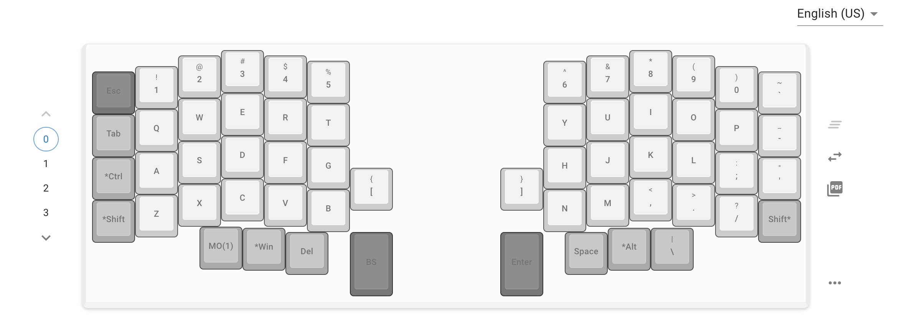

Lily58Proを購入し組み立てて使用開始して1年ほど経過しました。キーボードを使っていくにあたってのメモを記載していきます。
継続的に内容を追記や修正していく記事となります。

遊舎工房で購入しビルドガイドを見ながら組み立てをしました。ハンダつけしたこともないので、最初に練習として小さなマクロキーボードを買ってハンダつけしました。Lily58Proはハンダつけ箇所が多いので、初めにハンダつけはどんなものかを試しておいてよかったと思います。

 

## キーマップの変更

キーの数自体が少ないので、マクロキーを押しながら所定のキーを押すことで入力できるようにする必要がありますので、キーマップの変更を簡単にできるように便利なサイトがあります。キーボードを接続さえしていると自動的に検出して現在のキーマップを表示してくれます。キーマップの変更も直感的にできるようになっています。

[remap](https://qmk018.remap-keys.app/configure)

 

## キーキャップ

キーキャップは無刻印を使っています。安価なキーキャップですがいい作りをしています。若干マットな手触りです。hhkbの墨のキーキャップのような心地よい触り心地なので気に入っています。遊舎工房で買いました。

刻印無しの方がキーボードがよりすっきりとして見えますので気に入っています。キーマップを都度確認しながら使えるように、使うときはremapのサイトを開いてキーマップを表示した状態で使っています。特に普段あまり使わない記号の場所が覚えられないからです。覚えられていないですが不便さは感じません。

タイピングしやすくなるようにキーキャップの高さをキーによって変えてあります。この辺は実際に使いながらキーキャップを交換しながら試行錯誤しました。

